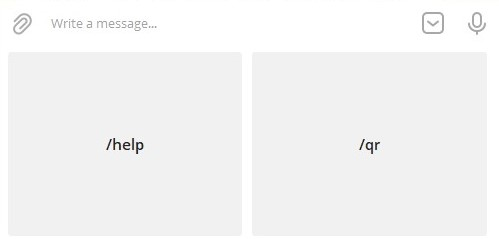
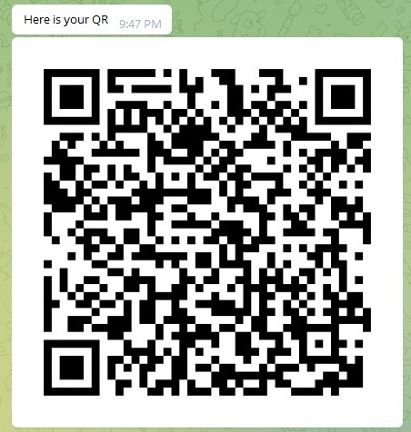

# Test of CI/CD systems using Telegram Bot app
Python Project with cloud Docker packaging

This bot receives text message from end-user, remembers them, and send you back a QR-code. 

Idea is *cloud based* application, which has to go through **pytest**, with using **Travis CI** for auto building and pulling app to **Docker** container.

To create the interaction between Telegram and local methods, was used a **pyTelegramBotAPI** 5.3
https://github.com/eternnoir/pyTelegramBotAPI
## Installation
This bot requires  [Python 3](https://www.python.org/downloads/) installation on your machine.

Use the package manager [pip](https://pip.pypa.io/en/stable/) to install packages:
```bash
pip install qrcode
pip install pyTelegramBotAPI
```
After that just clone the repository:
```bash
wget clone https://github.com/Galaxy13/telegram_bot-Docker.test.git
cd telegram_bot-Docker.test
```
## Usage
First, you need to create your Bot and get your Token from [Bot Father](t.me/BotFather) and write it into **token.txt**
```bash
cd ...\telegram_bot-Docker.test\scratches
vim token.txt
```
You should put token in token.txt, you received, without other symbols. 
[Example](example_token.txt)

Launch main.py:
```bash
python3 main.py
```
After that, your Bot is started, and Bot in-chat interaction too.

For using bot, user has a _**keyboard menu**_:



But, it can be used manually with three options:

**/start** - register user and remembers him

**/help** - shows to user all available commands

**/qr** - requesting bot for receiving a string to convert it to QR-code image

QR request returns to user a photo of QR-code in .png format with size 490x490

# Main contributors:
- **Overflow922**
- **Galaxy13**
